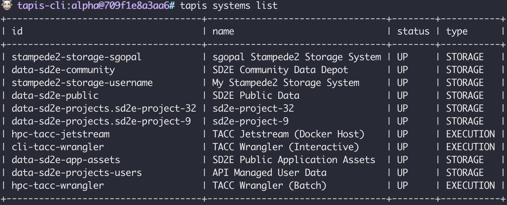
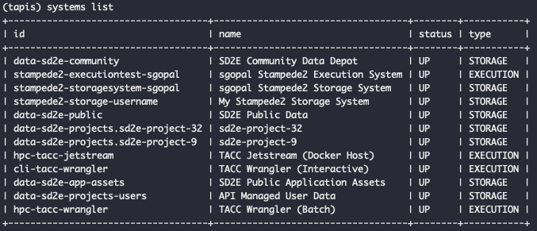

# tapis_systems

## Introduction:

a) A system in Tapis represents a server or collection of servers.

b) Systems are identified and referenced in Tapis by a unique ID unrelated to their ip address or hostname - hence, a single      physical system may be registered multiple times. 

c) Flexibility : Allows different users to configure and use a system in whatever way they need to for their specific needs.

d) Systems come in two flavors: storage and execution. 
    - Storage systems are only used for storing and interacting with data. 
    - Execution systems are used for running apps (aka jobs or batch jobs) as well as storing and interacting with data.

- Requirements: 

  1. Install the new Tapis client from: https://github.com/TACC-Cloud/tapis-cli-ng 

  2. With Tapis client installed, authenticate first:
     > auth init
     
     > systems list
     
     > apps list 
     
 ## Creating a storage system on Stampede2

  1. Create a JSON configuration file describing the type, name, host of the storage system to be created. 
     Follow the sample given here: https://tacc-cloud.readthedocs.io/projects/agave/en/latest/agave/guides/systems/systems- 
     storage.html
  2. Use the Tapis CLI client to add/register the system 
  
     > In old CLI: systems-addupdate -v -F stampede2-storage-sgopal.json
     
     > In new CLI: systems create -F stampede2-storage-sgopal.json
     
     Output:
     
     
     
     

     
  ## Creating an execution system on Stampede2
  
  1. Create a JSON configuration file describing the type, name, host of the storage system to be created. 
     Follow the sample given here: https://tacc-cloud.readthedocs.io/projects/agave/en/latest/agave/guides/systems/systems-
     execution.html
  2. There are many extra values that should be added: like define the queue for the system in use. 
  2. Use the Tapis CLI client to add/register the system 
  
     > In old CLI: systems-addupdate -v -F stampede2-execution-sgopal.json
     
     > In new CLI: systems create -F stampede2-execution-sgopal.json
     
     Output: 
     
     

## Creating an APP on the registered system

1. Follow: https://tacc-cloud.readthedocs.io/projects/agave/en/latest/agave/guides/apps/app-wrapper-templates.html
To install an app like samtools, creater a template file. 
These should be present on a Stampede system. 

2. Create a app json file: 

2. From local system: start tapis or agave cli

   > apps-addupdate -F app.json
   > app-list
   > jobs-template appid > job.json
   > jobs-submit -F job.json
   > job-status -v jobid
   
